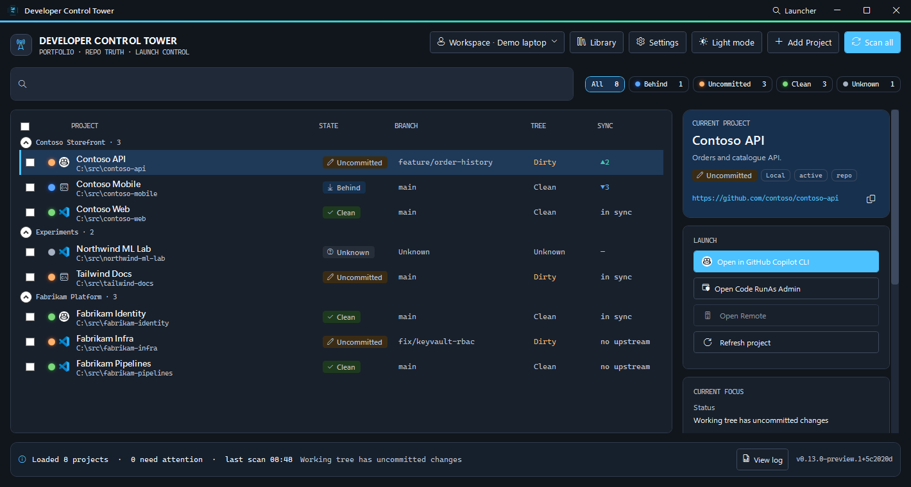
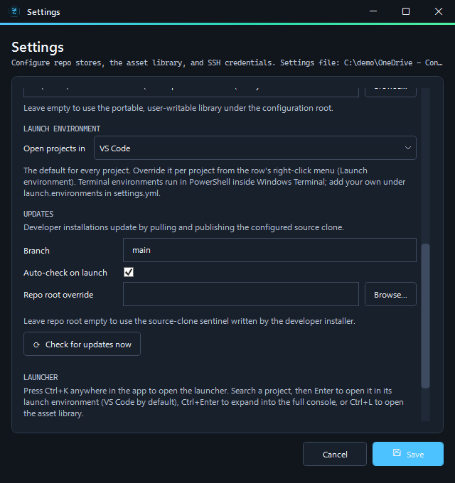

# Developer Control Tower

[](https://github.com/u64a/developer-control-tower/actions/workflows/ci.yml)
[](https://github.com/u64a/developer-control-tower/actions/workflows/codeql.yml)
[](https://scorecard.dev/viewer/?uri=github.com/u64a/developer-control-tower)
[](LICENSE)

Developer Control Tower is a lightweight, single-user Windows desktop app for
staying oriented across local, SSH, hosted-only, and hybrid Git projects. It
shows repository truth, keeps durable project context portable, and launches
the right work surface without becoming another planning system.



*Sample data only: the Contoso, Fabrikam, Northwind and Tailwind projects are fictional.*

## What it does

- Presents a dense, keyboard-friendly portfolio of known projects, grouped and
  filterable by state (behind, uncommitted, clean, unknown).
- Shows branch, working-tree, upstream, availability, and recent-activity state.
- Launches local VS Code, VS Code Remote SSH, GitHub, Azure DevOps, and docs.
- Opens each project in its launch environment (see below).
- Opens a Ctrl+K launcher anywhere in the app. Search for a project, press
  Enter to open it, Ctrl+Enter to expand into the full console, or Ctrl+L to
  open the asset library.
- Supports project registration, grouping, relocation, restore, and discovery.
- Uses user-named Workspace Profiles to scope one synced portfolio per device.
- Maintains a portable reusable-asset library with explicit push and pull.
- Follows light or dark mode, with a selectable accent colour.
- Stores SSH passwords and trusted fingerprints in Windows Credential Manager.

It does **not** provide sprint tracking, estimates, capacity planning,
collaboration, dashboards, or an always-on synchronization service.

## Launch environments

Every project opens in a launch environment. VS Code is the default. You can
also choose a terminal agent:

| Environment        | Opens                                                        |
| ------------------ | ------------------------------------------------------------ |
| VS Code            | The folder locally, or through Remote SSH for SSH projects.  |
| GitHub Copilot CLI | `copilot` in PowerShell inside Windows Terminal.             |
| Claude Code        | `claude` in PowerShell inside Windows Terminal.              |
| Custom             | Any command you define under `launch.environments` in `settings.yml`. |

Set the default under **Settings → Launch environment**. To override it for
one project, right-click that project's row and choose **Launch environment**.
Each row's launch button shows the icon of the tool that will open.

For SSH projects, terminal environments connect with your SSH configuration
and keys, then start the tool in the remote folder. Remote paths are
validated before they reach the remote shell. Product icons are read from the
tools installed on your machine, not bundled with the app. A generic terminal
icon appears when a tool isn't installed.



## Copilot CLI autostart

A project can start a Copilot CLI session as part of its launch, so you don't
have to open a terminal and retype the same command each time. Select the
project and use the **LAUNCH** card:

| Option    | Choices                                            | Flag             |
| --------- | -------------------------------------------------- | ---------------- |
| Autostart | Off by default; turning it on reveals the rest.     | —                |
| Session   | Resume previous session (default), or a named one.  | `--resume`, `--name` |
| Agent     | None (default), or a custom agent name.             | `--agent`        |
| VS Code terminal | Off by default; see below.                  | —                |
| `--yolo`  | Off by default.                                     | `--yolo`         |

The options are saved per project in that project's `project.yml`, so they
apply again the next time you launch it. A project that has never been
configured starts nothing, exactly as before.

Where the session appears depends on the launch environment:

- **GitHub Copilot CLI** — the flags are added to the session that already
  opens, so nothing extra is launched.
- **VS Code (or any editor environment)** — VS Code has no command line that
  opens its integrated terminal and runs a command, so Copilot CLI opens in a
  terminal beside the editor, in the same folder. If the editor opens but
  Copilot CLI cannot start, the editor launch still succeeds and the status
  line says why.
- **Another agent's CLI, such as Claude Code** — the options are hidden
  entirely. Those tools take different options, so there is nothing for
  Copilot autostart to do.
- **SSH projects launched into an editor** — no session starts, because
  Copilot CLI would run on this machine rather than the remote host.

### Running inside VS Code's terminal

VS Code has no command line that runs a command in its integrated terminal.
The only supported mechanism is a task that VS Code runs when it opens a
folder, so **Run in VS Code's terminal** generates one:

- `.vscode/tasks.json` is written before the editor starts, with a single
  `Developer Control Tower: Copilot CLI` task using `runOn: folderOpen`.
- An existing `tasks.json` is merged — only the tool's own label is replaced,
  and a file that cannot be parsed is left untouched and reported.
- The file is added to `.git/info/exclude`, so it never reaches a commit and
  no tracked `.gitignore` is modified.
- Clearing the checkbox removes the generated task again.

Two limits come from VS Code itself. The task runs only when the folder opens
in a **new** window, so an already-open project just gets focus and no
session. And the first automatic task of any kind needs permission, which VS
Code records as `"task.allowAutomaticTasks": "on"` in your **user** settings —
a global switch, so from then on any folder with such a task runs it without
asking. Set it to `"auto"` if you would rather be asked per folder.

**Open Code RunAs Admin** starts the Copilot session too. The editor is
elevated but the Copilot terminal is not, because the CLI never needs
Administrator. If Developer Control Tower is itself already running elevated,
Windows raises no prompt and VS Code opens as a new window inside the elevated
instance you already have, which is easy to miss among existing windows.

Session and agent names are limited to letters, numbers, dot, underscore and
hyphen. Anything else is refused rather than placed on a command line, and a
hand-edited `project.yml` containing an unsupported name loads with a warning
and ignores that name.

## Install

Download the Setup file for your architecture from
[GitHub Releases](https://github.com/u64a/developer-control-tower/releases):

- `win-x64` for Intel and AMD 64-bit Windows;
- `win-arm64` for ARM64 Windows.

The one-click installer is per-user and installs under
`%LOCALAPPDATA%\u64a.DeveloperControlTower`. Updates stay on the architecture
channel originally installed. Release builds are self-contained, so no
separate .NET runtime is needed. Git, VS Code, Windows Terminal, and any
terminal agents you choose are used from your own installation.

> [!WARNING]
> Preview installers are not yet Authenticode-signed. Windows may show a
> SmartScreen or Defender reputation warning. Download only from this
> repository, verify the published SHA-256 file, and use
> `gh attestation verify <file> --repo u64a/developer-control-tower` when
> possible.

## Portable data

The app keeps portable configuration outside the replaceable install folder:

1. OneDrive for Business, when available;
2. personal OneDrive;
3. `%APPDATA%` as a local fallback.

The default asset library lives under that same configuration root. Machine
preferences, cache, and logs live under
`%LOCALAPPDATA%\DeveloperControlTower`. Credentials remain in Windows
Credential Manager.

Uninstalling from Windows Settings removes only the app and preserves all data.
The in-app uninstall flow can instead remove:

1. the app plus machine-local state while keeping portable data;
2. portable configuration while keeping the asset library;
3. the entire app-managed portable folder, including the default library.

Credential Manager entries are always preserved because Git and other tools
may share them.

## Build

Building requires the .NET 10 SDK pinned in [global.json](global.json).

```powershell
dotnet restore DeveloperControlTower.sln --locked-mode
dotnet build DeveloperControlTower.sln -c Release --no-restore
dotnet test DeveloperControlTower.sln -c Release --no-restore
```

Create both release channels locally:

```powershell
.\Build-ReleasePackages.ps1
```

The release script restores the pinned Velopack CLI, validates locked
dependencies, runs tests, verifies each native PE architecture, rejects the
private legacy-library boundary, and emits Setup, portable, feed, package,
SBOM-ready, and SHA-256 artifacts.

See [CONTRIBUTING.md](CONTRIBUTING.md), [SECURITY.md](SECURITY.md), and
[docs/architecture.md](docs/architecture.md).

## Licence

MIT. See [LICENSE](LICENSE) and [THIRD_PARTY_NOTICES.md](THIRD_PARTY_NOTICES.md).
